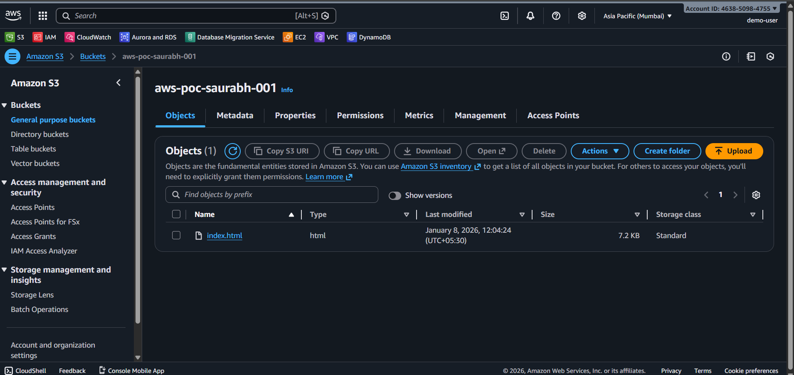
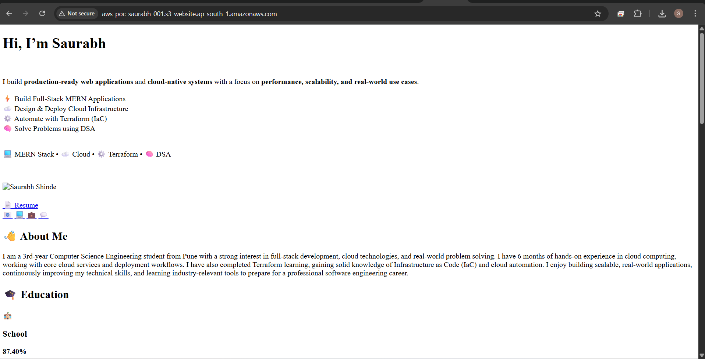

# Amazon-S3-Storage-Static-Hosting-PoC

 

 

🎯 Objective
•	Create and configure S3 bucket
•	Upload objects (files)
•	Enable security & versioning
•	Host a static website 

🔹 Step 1: Create S3 Bucket
1.	Login to AWS Console
2.	Go to Services → S3
3.	Click Create bucket
4.	Bucket name:
5.	aws-poc-saurabh-001
6.	Region: Asia Pacific (Mumbai)
7.	Uncheck “Block all public access” (only for PoC)
8.	Click Create bucket

🔹 Step 2: Upload File
1.	Open the bucket
2.	Click Upload
3.	Upload:
o	index.html
o	image / pdf (any test file)
4.	Click Upload

🔹 Step 3: Enable Versioning
1.	Bucket → Properties
2.	Enable Versioning
3.	Save
✔ Now AWS keeps multiple versions of the same file

Step 4: Enable Static Website Hosting (PoC)
1.	Bucket → Properties
2.	Scroll → Static website hosting
3.	Enable
4.	Index document:
5.	index.html
6.	Save

Step 5: Bucket Policy (Public Access)
Go to Permissions → Bucket Policy
Paste this 👇
{
  "Version": "2012-10-17",
  "Statement": [
    {
      "Sid": "PublicReadGetObject",
      "Effect": "Allow",
      "Principal": "*",
      "Action": "s3:GetObject",
      "Resource": "arn:aws:s3:::aws-poc-saurabh-001/*"
     ]
}
✔ Replace bucket name properly

🔹 Step 6: Test Website
1.	Go to Properties
2.	Copy Static Website URL
3.	Open in browser
✔ Website opens from S3 🎉
